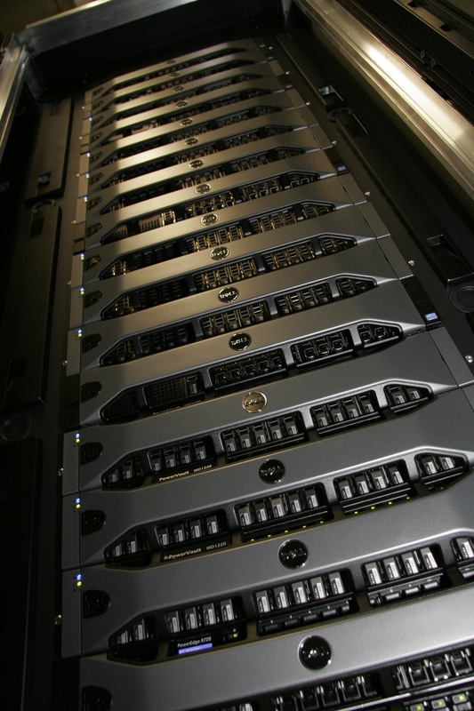
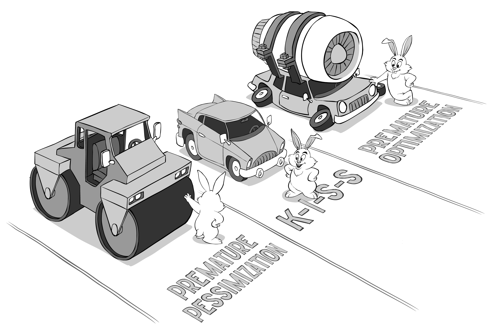
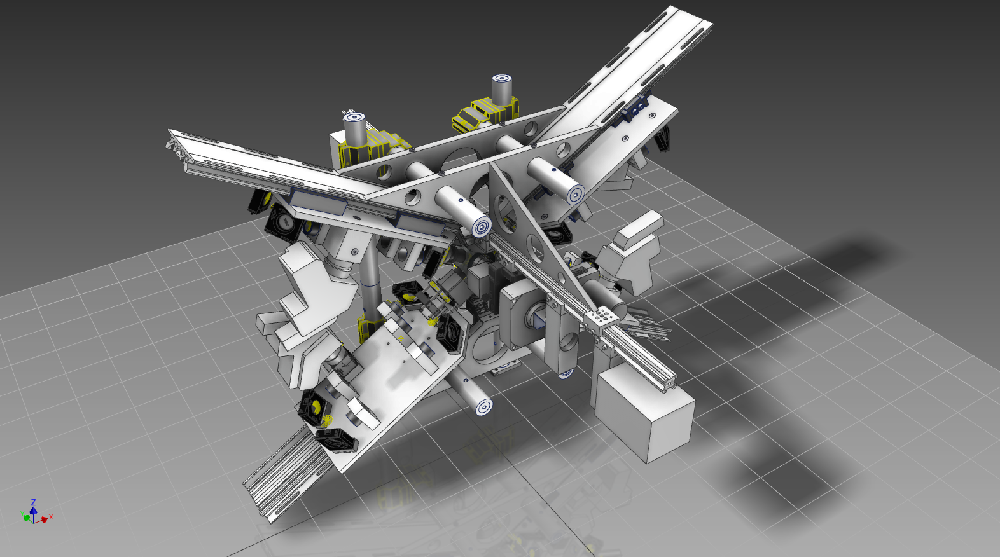
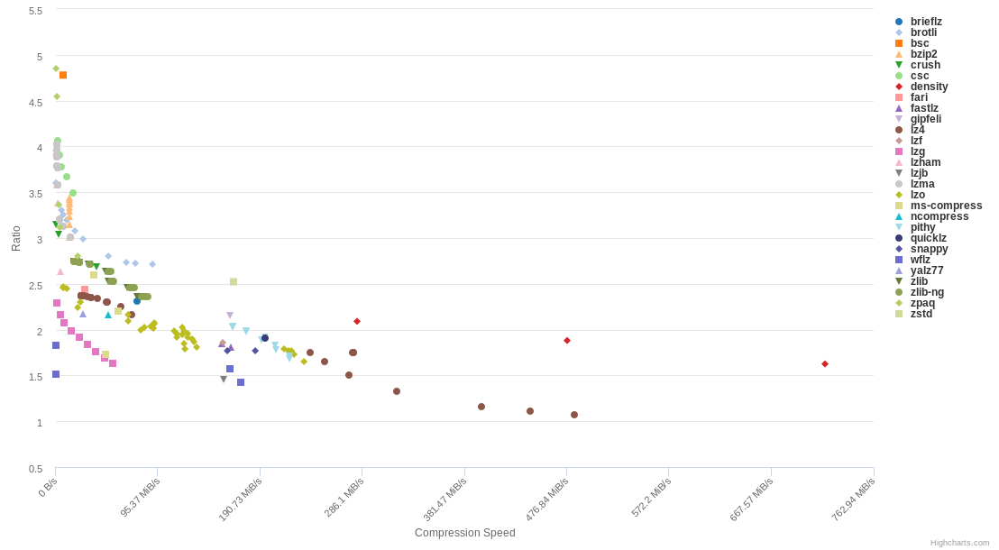

# Agenda {-}

## For the next 60 Minutes ... {#agenda style="font-size: 1.5em"}

1. Peter who?
2. 3D Microscopy
4. Compression
5. Sqeazy
6. Portable Performance


## Disclaimer

.container-fluid[

.row justify-content-center[

  .col[

{ class="figure-img img-fluid" width="40%" }  

**[github.com/psteinb/pain-of-performance-portability](https://github.com/psteinb/pain-of-performance-portability)**


  .]

.]

.]


:notes[

report bugs and questions there!

:]


# About me

## [Scionics Computer Innovation GmbH](https://www.scionics.de)

&nbsp;

.container-fluid[

.row align-items-center[

.col[

{ class="figure-img img-fluid" width="70%" }

.]

.col[

- founded in 2001
- located in Dresden, Saxony (Germany)
- currently 35 staff
- consulting and software products for industry and academia

.]

.]

.]


&nbsp;

Need Help with Data Analysis, Machine Learning, Parallelisation or Performance Engineering ?   
[Get in Touch!](mailto:steinbach@scionics.de)


## Max-Planck Institute for Molecular Cell Biology and Genetics

.container-fluid[

.row align-items-center[

.col[

{ class="figure-img img-fluid" height="50%" }  

[Max Planck Institute of Molecular Cell Biology and Genetics](https://www.mpi-cbg.de) (MPI CBG), 500 staff

.]

.col[

{ class="figure-img img-fluid" height="50%" }  

[Center for Systems Biology](http://www.csbdresden.de/), (CSBD) 150 staff

.]

.]

.]


:notes[

- employer = Scionics
- NEXT: my role

:]


## My Role

.container-fluid[

.row align-items-center[

.col[

HPC  

{ class="figure-img img-fluid" }  

.]

.col[

Performance  

{ class="figure-img img-fluid" }  
by [Sergey Ignatchenko](http://ithare.com/c-performance-common-wisdoms-and-common-wisdoms/) 

.]

.]

.]


# 3D Microscopy

## Selective Plane Illumination

](img/Spim_prinziple_en.svg){ class="img-fluid" style="width: 70%;" } 

## Living Embryo Development

<video width="1400" poster="video/Drosophila_Embryogenesis_beads_removed.png" controls loop>
<source src="video/Drosophila_Embryogenesis_beads_removed.webm" type='video/webm; codecs="vp8.0, vorbis"'> 
<source src="video/Drosophila_Embryogenesis_beads_removed.mp4" type='video/mp4'>
<p>Movie does not work! Sorry!</p>
</video>

from [openSPIM](http://openspim.org/Gallery)


## Living Organism 

<video width="1400" poster="video/developing-drosophila-neuronal-cells.png" controls loop>
<source src="video/developing-drosophila-neuronal-cells.webm" type='video/webm; codecs="vp8.0, vorbis"'> 
<!-- <source src="video/Drosophila_Embryogenesis_beads_removed.mp4" type='video/mp4'> -->
<p>Movie does not work! Sorry!</p>
</video>

from [A. Bassi et al, Optical tomography complements light sheet microscopy for in toto imaging of zebrafish development](http://dev.biologists.org/content/142/5/1016)

## Innovation = Challenges

.container-fluid[

.row align-items-top[

.col[

Commercial : [Zeiss Lightsheet Z1](https://www.zeiss.com/microscopy/us/products/imaging-systems/lightsheet-z-1.html)

.]

.col[

Custom : [Xscope](https://www.mpi-cbg.de/research-groups/current-groups/gene-myers/projects/microscope-development/) by Nicola Maghelli et al (MPI CBG)

.]

.]

.]

.container-fluid[

.row align-items-center[

.col[

{ class="img-fluid" style="width: 90%;" }  

.]

.col[

{ class="img-fluid" style="width: 90%;" }  

.]

.]

.]

.container-fluid[

.row align-items-top[

.col[

[120-240 MB/s for 24/7]{.class class="fragment highlight-green" style="font-size: 1.5em"}

.]

.col[

[500-1024 MB/s for 24/7]{.class class="fragment highlight-red" style="font-size: 1.5em"}

.]

.]

.]

:notes[

- custom: 48-86 TB/day
- custom: 1.2-2.5 PB/month

:]


## Big Data! { data-background-image="img/1280px-Panic_button.jpg" }

by [John](https://commons.wikimedia.org/wiki/File:Panic_button.jpg), CC BY-SA 2.0


# Compression

## Lempel–Ziv–Welch Algorithm

- dictionary based losslessl compression
- at the heart of many compression algorithms today
- DEFLATE = LZW + huffman encoding
- ZIP, PNG, TIFF ...


## Example

```{style="font-size: 1.25em"}
TOBEORNOTTOBEORTOBEORNOT#
```

. . . 

&nbsp;

.container-fluid[

.row align-items-top[

.col[

- alphabet of 26+1 characters  
(capital letters + stop code #) 
- alphabet can be represented by $2^5$ values


.]

.col[


```
'#' : 0x0 {0}
'A' : 0x1 {1}
'B' : 0x2 {2}
...
'Z' : 0x1a {26}
```

.]

.]

.]


## LZW 1

```{style="font-size: 1.25em"}
TOBEORNOTTOBEORTOBEORNOT#
^
```

&nbsp;

.container-fluid[

.row align-items-center[

.col[

- TO unknown, add to dict
- T known, emit 20

.]

.col[

written:

```
{20}
```

dictionary:

```
'#'  : 0x0  {0}
'A'  : 0x1  {1}
...
'T'  : 0x14 {20}
...
'Z'  : 0x1a {26}
'TO' : 0x1b {27}
```

.]

.]

.]

## LZW 2

```{style="font-size: 1.25em"}
TOBEORNOTTOBEORTOBEORNOT#
 ^
```

&nbsp;

.container-fluid[

.row align-items-center[

.col[

- OB unknown, add to dict
- O known, emit 15

.]

.col[

written:

```
{20}{15}
```

dictionary:

```
'#'  : 0x0  {0}
'A'  : 0x1  {1}
...
'T'  : 0x14 {20}
...
'TO' : 0x1b {27}
'OB' : 0x1c {28}
```

.]

.]

.]

## LZW 3

```{style="font-size: 1.25em"}
TOBEORNOTTOBEORTOBEORNOT#
  ^
```

&nbsp;

.container-fluid[

.row align-items-center[

.col[

- BE unknown, add to dict
- B known, emit 2

.]

.col[

written:

```
{20}{15}{2}
```

dictionary:

```
'#'  : 0x0  {0}
'A'  : 0x1  {1}
...
'B'  : 0x2  {2}
...
'OB' : 0x1c {28}
'BE' : 0x1d {29}
```

.]

.]

.]

## LZW 4

```{style="font-size: 1.25em"}
TOBEORNOTTOBEORTOBEORNOT#
   ^
```

&nbsp;

.container-fluid[

.row align-items-center[

.col[

- EO unknown, add to dict
- E known, emit 5

.]

.col[

written:

```
{20}{15}{2}{5}
```

dictionary:

```
'#'  : 0x0  {0}
'A'  : 0x1  {1}
...
'E'  : 0x5  {5}
...
'BE' : 0x1d {29}
'EO' : 0x1e {30}
```

.]

.]

.]

## LZW 10

```{style="font-size: 1.25em"}
TOBEORNOTTOBEORTOBEORNOT#
         ^
```

&nbsp;

.container-fluid[

.row align-items-center[

.col[

- TOB unknown, add to dict
- TO known, emit 27
- [1 symbol, 2 characters]{.class class="fragment highlight-red"}

.]

.col[

written:

```
{20}{15}{2}{5}{15}{18}{14}{15}{20}{27}
```

dictionary:

```
'#'  : 0x0  {0}
'A'  : 0x1  {1}
...
'TE' : 0x1b {27}
...
'TT' : 0x23 {35}
'TOB': 0x24 {36}
```

.]

.]

.]

## LZW Final

```
TOBEORNOTTOBEORTOBEORNOT#
{20}{15}{2}{5}{15}{18}{14}{15}{20}{27}{29}{31}{36}{30}{32}{34}{0}
```

. . . 

&nbsp;

.container-fluid[

.row align-items-top[

.col-8[

- original:  
25 symbols × 5 b/symbol = 125 b
- encoded :  
(6 codes × 5 b/code) + (11 codes × 6 b/code) = **96 b**


.]

.col-4[

```
'#'  : 0x0  {0}
'A'  : 0x1  {1}
...
'EOR': 0x28 {40}
'RNO': 0x29 {41}
```

.]

.]

.]


## LZ4 and friends

- upspur of new and fast compression libraries in the last years
    + lz4 by Yann Collet
    + zstd by Yann Collet (Facebook)
    + [brotli](https://github.com/google/brotli) by google
    ...
    
[](https://quixdb.github.io/squash-benchmark/)

:notes[

- squash: largest dataset = 95MB text

:]
  
## On our 16bit data?

lz4
```
/dev/shm $ time lz4 spim_sample.tif                              
Compressed filename will be : mit_sample.tif.lz4 
Compressed 423637504 bytes into 302613798 bytes ==> 71.43%                     
lz4 spim_sample.tif  1.28s user 0.18s system 99% cpu 1.470 total
```
405MB file, 289MB encoded, [316 MB/s]{.class class="fragment highlight-red"}  ingest


. . .

&nbsp;

zstd
```
/dev/shm $ time zstd spim_sample.tif
mit_sample.tif       : 44.11%   (423637504 => 186867090 bytes, mit_sample.tif.zst) 
zstd spim_sample.tif  3.96s user 0.16s system 104% cpu 3.936 total
```
405MB file, 179MB encoded, [102 MB/s]{.class class="fragment highlight-red"} ingest


:notes[

- speed versus compression ratio trade-off
- requirements are high!
- 16bit data (yields gaps)
- NEXT: compression+preprocessing

:]


# Sqeazy

## Requirements

.container-fluid[

.row justify-content-center[

  .col[

- provide compression at 500 MB/s or more
- target:
    + lossless: 3x or more
    + lossy: 10x or more
- flexible pipeline definition
- support video codecs ([x264](https://www.videolan.org/developers/x264.html), [x265](http://x265.readthedocs.io/en/default/))
- support community file formats like [HDF5](https://www.hdfgroup.com)
    
  .]

.col[

- support 16 and 8-bit data types
- multi-core
- x86
- Linux, macOS and _Win7_
- redistributable binary
- interface to Java

.]


.]

.]

. . . 


[**Good Luck!**]{.class style="font-size: 1.5em; color: yellow;"}


:notes[

- NEXT: why pipelines?

:]


## Bitshuffle

Original (6 pixel values of 16 bit)

```
                9                 1                 2                12             56013             36742
00000000 00001001 00000000 00000001 00000000 00000010 00000000 00001100 11011010 11001101 10001111 10000110
```

Bitplane 0

```
                9                 1                 2                12             56013             36742
00000000 00001001 00000000 00000001 00000000 00000010 00000000 00001100 11011010 11001101 10001111 10000110
^                 ^                 ^                 ^                 ^                 ^
-> 000011
```

Bitplane 15

```
                9                 1                 2                12             56013             36742
00000000 00001001 00000000 00000001 00000000 00000010 00000000 00001100 11011010 11001101 10001111 10000110
                ^                 ^                 ^                 ^                 ^                 ^
-> 110010
```


    

## Pipelining

On the command-line:

```
$ sqy encode -p 'bitswap1->lz4' my.tif
```

From Java:

```
final Pointer<Byte> bPipelineName = Pointer.pointerToCString("bitswap->lz4");
SqeazyLibrary.SQY_PipelineEncode_UI16(bPipelineName,lSourceBytes,
									  lSourceShape,3,
									  lCompressedBytes,lPointerToDestinationLength,
									  1)
```

Internal C++:

```
auto pipe = sqeazy::dynamic_pipeline<std::uint16_t>::from_string("bitswap1->lz4");
char* encoded_end = pipe.encode(input.data(),
                                encoded.data(),
                                shape);
```

original: 140MB, lz4-only: 114MB, bitshuffle+lz4: 60MB

:notes[

- pipelines important to reshape/filter data
- 

:]


## Sqeazy Pipelines

```
template <
    typename raw_t,
    template<typename = raw_t> class filter_factory_t = default_filter_factory,
    typename inbound_sink_factory_t = default_sink_factory<raw_t>,
    typename optional_tail_factory_t = void
    >
  struct dynamic_pipeline
{

    std::vector<std::shared_ptr<base_stage<raw_t> > > stages;

}
```

:notes[

- first attempt: static pipelines with Boost.MTL
- pipeline object checks if stages fit
- KISS
- NEXT: Temporaries

:]


## A Need for Temporaries?

```
out_type* dynamic_pipeline::encode(const in_type* raw, out_type* encoded, shape_t shape){

   header_t hdr(in_type(), shape, this->name());
   char* start_here = std::copy(hdr.c_str(),hdr.c_str()+hdr.size(),
                                    static_cast<char*>(encoded));
                                    
   for( stage_t stage : stages ){
   
        stage.encode(raw,encoded,shape);
        std::swap(raw,encoded);
   
   }

}
```

:notes[

- rough draft of core functionality
- problem: output never of constant size 
( encoder overhead, meta data )
- allocating temporaries consumes resources

:]


## Latency Hiding

```
template <typename T>
using unique_array = std::unique_ptr<T[], boost::alignment::aligned_delete>;

out_type* dynamic_pipeline::encode(const in_type* raw, out_type* encoded, shape_t shape){

   std::future<unique_array<incoming_t>> temp = std::async(make_aligned<incoming_t>,
                                                           std::size_t(32),
                                                           scratchpad_bytes);

   header_t hdr(in_type(), shape, this->name());
   char* start_here = std::copy(hdr.c_str(),hdr.c_str()+hdr.size(),
                                    static_cast<char*>(encoded));
   
   encoded = temp.get();
   for( int s = 0; s< stages.size();++s){
   
        stage.encode(raw,encoded,shape);
        std::swap(raw,encoded);
   
   }

}
```

:notes[

- overhead of allocations mitigated
- pipeline that does nothing ~ memcpy speed
- HERE: coding with performance
- NEXT: performance

:]


# Portable Performance

## Perspectives and illusions

.container-fluid[

.row align-items-center[

  .col[

](img/737px-My_Wife_and_My_Mother-in-Law.jpg){ class="img-fluid" style="width: 60%;" }
   
  .]

.col[

Portable Performance as **same performance on every system** is [impossible]{.class class="fragment highlight-red"}  

- cache level volume(s) depends on price
- memory system changes (bytes per flops)
- clock counts, turbo boosts
- instruction sets available
- installed runtime library versions

.]

.]

.]

:notes[

- ignore real-time hardware for now
- focus on x86
- very hardware centered view
- domain metrics *often* less sensitive
- NEXT: way out

:]


## Manage Expectations


.container-fluid[

.row align-items-center[

  .col[

{ class="img-fluid" style="width: 60%;" }
   
  .]

.col[

Honest Performance

- communicate hardware requirements
- speak in units of the domain (e.g. images per second, pixels per second)
- give ranges (e.g. algorithm can compress from 0.95 to 3x on our test data) 
- provide reproducible benchmarks (at best which can be run by user)

.]

.]

.]


## Adaptive Algorithms?

.container-fluid[

.row align-items-center[

  .col[

](img/proper_tools.jpg){ class="img-fluid" style="width: 60%;" }
   
  .]

.col[


From [blosc tutorial](http://python-blosc.blosc.org/tutorial.html#fine-tuning-compression-parameters):

> Often the L2 cache size (e.g. 256kB for an Intel Haswell) is a good starting point for optimization.


.]

.]

.]

:notes[

- user based blocksize setting not necessary
- implementations should be clever enough
- NEXT: compass

:]


## [compass](https://github.com/psteinb/compass)

.container-fluid[

.row align-items-top[

  .col[

- single-header library (thanks to [pcpp](https://github.com/ned14/pcpp))
- easy drop-in to your project
- detect hardware features at runtime
   
  .]

.col[

- detect (some) compile-time features
- enables sensible hardware specific defaults

.]

.]

.]

&nbsp;

](img/compass-repo.png){ class="img-fluid" style="width: 80%;" }


## compass features

```
static const bool has_sse2 = compass::compiletime::has<compass::feature::sse2>::value);
if(has_sse2)
{
  do_magic_with_sse2();
}
```

```
auto has_avx2 = compass::runtime::has(compass::feature::avx2());
if(has_avx2)
{
  do_magic_with_avx2();
}
```

. . .

```
auto L2_in_kb = compass::runtime::size::cache::level(2);
foo.set_blocksize(L2_in_kb*.75)
```

## compass benchmark

```
Run on (4 X 3600 MHz CPU s)
2018-05-14 17:37:29
***WARNING*** CPU scaling is enabled, the benchmark real time measurements may be noisy and will incur extra overhead.
--------------------------------------------------------------
Benchmark                       Time           CPU Iterations
--------------------------------------------------------------
BM_compass_sse4_1              31 ns         31 ns   22705074
BM_cpu_features_sse4_1        242 ns        241 ns    2870098
```

Competition ([google/cpu_features](https://github.com/google/cpu_features)) is hard but not unbeatable

<!-- ## Background estimation -->

<!-- 1. estimate median and variance of noise -->
<!-- 2. reduce all pixels by (mean+1*variance) -->
<!-- 3. clamp all negative intensities to 0 -->

<!-- ** how many samples to collect for median/variance ? ** -->

<!-- :notes[ -->

<!-- - algorithm provides minimal loss -->
<!-- - can boost compression ratio to 15x -->
<!-- - options: fixed number of pixels, adapt to host at runtime -->
<!-- - NEXT: compass -->

<!-- :] -->

## Tools

## flamegraphs et al

## parallelisation

## state of the cross-platform union

## C++17

## C++20 cancellable tasks

# Summary

