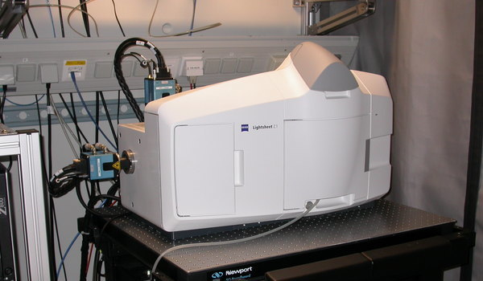

# Agenda {-}

## For the next 60 Minutes ... {#agenda style="font-size: 1.5em"}

1. Peter who?
2. 3D Microscopy
4. Compression
5. Sqeazy
6. Portable Performance


## Disclaimer

.container-fluid[

.row justify-content-center[

  .col[

{ class="figure-img img-fluid" width="40%" }  

**[github.com/psteinb/pain-of-performance-portability](https://github.com/psteinb/pain-of-performance-portability)**


  .]

.]

.]


:notes[

report bugs and questions there!

:]


# About me

## [Scionics Computer Innovation GmbH](https://www.scionics.de)

.container-fluid[

.row align-items-center[

.col[

{ class="figure-img img-fluid" width="70%" }

.]

.col[

- founded in 2001
- located in Dresden, Saxony (Germany)
- currently 35 staff
- consulting and software products for industry and academia

.]

.]

.]


## Max-Planck Institute for Molecular Cell Biology and Genetics

.container-fluid[

.row align-items-center[

.col[

{ class="figure-img img-fluid" height="50%" }  

[Max Planck Institute of Molecular Cell Biology and Genetics](https://www.mpi-cbg.de) (MPI CBG), 500 staff

.]

.col[

{ class="figure-img img-fluid" height="50%" }  

[Center for Systems Biology](http://www.csbdresden.de/), (CSBD) 150 staff

.]

.]

.]


:notes[

- employer = Scionics
- NEXT: my role

:]


## My Role

.container-fluid[

.row align-items-center[

.col[

HPC  

{ class="figure-img img-fluid" }  

.]

.col[

Performance  

{ class="figure-img img-fluid" }  
by [Sergey Ignatchenko](http://ithare.com/c-performance-common-wisdoms-and-common-wisdoms/) 

.]

.]

.]


# 3D Microscopy

## Selective Plane Illumination

](img/Spim_prinziple_en.svg){ class="img-fluid" style="width: 70%;" } 

## Living Embryo Development

<video width="1400" poster="video/Drosophila_Embryogenesis_beads_removed.png" controls loop>
<source src="video/Drosophila_Embryogenesis_beads_removed.webm" type='video/webm; codecs="vp8.0, vorbis"'> 
<source src="video/Drosophila_Embryogenesis_beads_removed.mp4" type='video/mp4'>
<p>Movie does not work! Sorry!</p>
</video>

from [openSPIM](http://openspim.org/Gallery)


## Living Organism 

<video width="1400" poster="video/developing-drosophila-neuronal-cells.png" controls loop>
<source src="video/developing-drosophila-neuronal-cells.webm" type='video/webm; codecs="vp8.0, vorbis"'> 
<!-- <source src="video/Drosophila_Embryogenesis_beads_removed.mp4" type='video/mp4'> -->
<p>Movie does not work! Sorry!</p>
</video>

from [A. Bassi et al, Optical tomography complements light sheet microscopy for in toto imaging of zebrafish development](http://dev.biologists.org/content/142/5/1016)

## Innovation = Challenges

.container-fluid[

.row align-items-top[

.col[

Commercial : [Zeiss Lightsheet Z1](https://www.zeiss.com/microscopy/us/products/imaging-systems/lightsheet-z-1.html)

.]

.col[

Custom : [Xscope](https://www.mpi-cbg.de/research-groups/current-groups/gene-myers/projects/microscope-development/) by Nicola Maghelli et al (MPI CBG)

.]

.]

.]

.container-fluid[

.row align-items-center[

.col[

{ class="img-fluid" style="width: 90%;" }  

.]

.col[

{ class="img-fluid" style="width: 90%;" }  

.]

.]

.]

.container-fluid[

.row align-items-top[

.col[

[120-240 MB/s for 24/7]{.class class="fragment highlight-green" style="font-size: 1.5em"}

.]

.col[

[500-1024 MB/s for 24/7]{.class class="fragment highlight-red" style="font-size: 1.5em"}

.]

.]

.]

:notes[

- custom: 48-86 TB/day
- custom: 1.2-2.5 PB/month

:]


## Big Data! { data-background-image="img/1280px-Panic_button.jpg" }

by [John](https://commons.wikimedia.org/wiki/File:Panic_button.jpg), CC BY-SA 2.0


# Compression

## Lempel–Ziv–Welch

- at the heart of many compression algorithms today
- DEFLATE = LZW + huffman encoding
- ZIP, PNG, TIFF ...

## Example

```{style="font-size: 1.25em"}
TOBEORNOTTOBEORTOBEORNOT#
```

. . . 

&nbsp;

.container-fluid[

.row align-items-top[

.col[

- alphabet of 26+1 characters  
(capital letters + stop code #) 
- alphabet can be represented by $2^5$ values


.]

.col[


```
'#' : 0x0 {0}
'A' : 0x1 {1}
'B' : 0x2 {2}
...
'Z' : 0x1a {26}
```

.]

.]

.]


## LZW 1

```{style="font-size: 1.25em"}
TOBEORNOTTOBEORTOBEORNOT#
^
```

&nbsp;

.container-fluid[

.row align-items-center[

.col[

- TO unknown, add to dict
- T known, emit 20

.]

.col[

written:

```
{20}
```

dictionary:

```
'#'  : 0x0  {0}
'A'  : 0x1  {1}
...
'T'  : 0x14 {20}
...
'Z'  : 0x1a {26}
'TO' : 0x1b {27}
```

.]

.]

.]

## LZW 2

```{style="font-size: 1.25em"}
TOBEORNOTTOBEORTOBEORNOT#
 ^
```

&nbsp;

.container-fluid[

.row align-items-center[

.col[

- OB unknown, add to dict
- O known, emit 15

.]

.col[

written:

```
{20}{15}
```

dictionary:

```
'#'  : 0x0  {0}
'A'  : 0x1  {1}
...
'T'  : 0x14 {20}
...
'TO' : 0x1b {27}
'OB' : 0x1c {28}
```

.]

.]

.]

## LZW 3

```{style="font-size: 1.25em"}
TOBEORNOTTOBEORTOBEORNOT#
  ^
```

&nbsp;

.container-fluid[

.row align-items-center[

.col[

- BE unknown, add to dict
- B known, emit 2

.]

.col[

written:

```
{20}{15}{2}
```

dictionary:

```
'#'  : 0x0  {0}
'A'  : 0x1  {1}
...
'B'  : 0x2  {2}
...
'OB' : 0x1c {28}
'BE' : 0x1d {29}
```

.]

.]

.]

## LZW 4

```{style="font-size: 1.25em"}
TOBEORNOTTOBEORTOBEORNOT#
   ^
```

&nbsp;

.container-fluid[

.row align-items-center[

.col[

- EO unknown, add to dict
- E known, emit 5

.]

.col[

written:

```
{20}{15}{2}{5}
```

dictionary:

```
'#'  : 0x0  {0}
'A'  : 0x1  {1}
...
'E'  : 0x5  {5}
...
'BE' : 0x1d {29}
'EO' : 0x1e {30}
```

.]

.]

.]

## LZW 10

```{style="font-size: 1.25em"}
TOBEORNOTTOBEORTOBEORNOT#
         ^
```

&nbsp;

.container-fluid[

.row align-items-center[

.col[

- TOB unknown, add to dict
- TO known, emit 27
- [1 symbol, 2 characters]{.class class="fragment highlight-red"}

.]

.col[

written:

```
{20}{15}{2}{5}{15}{18}{14}{15}{20}{27}
```

dictionary:

```
'#'  : 0x0  {0}
'A'  : 0x1  {1}
...
'TE' : 0x1b {27}
...
'TT' : 0x23 {35}
'TOB': 0x24 {36}
```

.]

.]

.]


## LZ4 and friends


## But ... on 16bit data?


# Sqeazy

## Requirements

## Bitshuffle

## (Blos-c)

## Algorithms

## Pipelining

## Pipeline Temporaries

## Async Alloc

# Portable Performance

## Perspective

## Adaptive Algorithms?

## Background estimation

## compass

## compass details

## compass benchmark

## Tools

## kerncraft

## parallelisation

## state of the cross-platform union

## C++17

## C++20 cancellable tasks

# Summary

