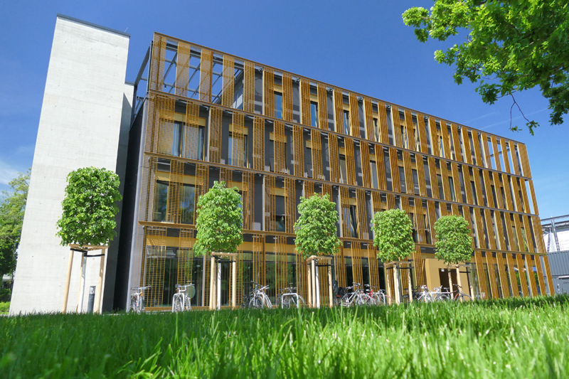

# Agenda {-}

## For the next 60 Minutes ... {#agenda style="font-size: 1.5em"}

1. Peter who?
2. 3D Microscopy
4. Compression
5. Sqeazy
6. Portable Performance

## Disclaimer

.container-fluid[

.row justify-content-center[

  .col[

{ class="figure-img img-fluid" width="40%" }  

**[github.com/psteinb/pain-of-performance-portability](https://github.com/psteinb/pain-of-performance-portability)**

  .]

.]

.]

:notes[

report bugs and questions there!

:]

# About me

## [Scionics Computer Innovation GmbH](https://www.scionics.de)

.container-fluid[

.row align-items-center[

.col[

{ class="figure-img img-fluid" width="70%" }

.]

.col[

- founded in 2001
- located in Dresden, Saxony (Germany)
- currently 35 staff
- consulting and software products for industry and academia

.]

.]

.]

## Max-Planck Institute for Molecular Cell Biology and Genetics

.container-fluid[

.row align-items-center[

.col[

{ class="figure-img img-fluid" height="50%" }  

[Max Planck Institute of Molecular Cell Biology and Genetics](https://www.mpi-cbg.de) (MPI CBG), 500 staff

.]

.col[

{ class="figure-img img-fluid" height="50%" }  

[Center for Systems Biology](http://www.csbdresden.de/), (CSBD) 150 staff

.]

.]

.]

:notes[

- employer = Scionics
- NEXT: my role

:]

## My Role

.container-fluid[

.row align-items-top[

.col[

HPC  

{ class="figure-img img-fluid" }  

.]

.col[

Performance  

](img/premature_optimisation.png){ class="figure-img img-fluid" }  

.]

.]

.]

# 3D Microscopy

## Selective Plane Illumination

## Living Embryo Development

## Living Organism Perturbed

## Innovation = Challenges

## Big Data

# Compression

## LZW explained

## LZ4 and friends

## But ... on 16bit data?

# Sqeazy

## Requirements

## Bitshuffle

## (Blos-c)

## Algorithms

## Pipelining

## Pipeline Temporaries

## Async Alloc

# Portable Performance

## Perspective

## Adaptive Algorithms?

## Background estimation

## compass

## compass details

## compass benchmark

## Tools

## kerncraft

## parallelisation

## state of the cross-platform union

## C++17

## C++20 cancellable tasks

# Summary

